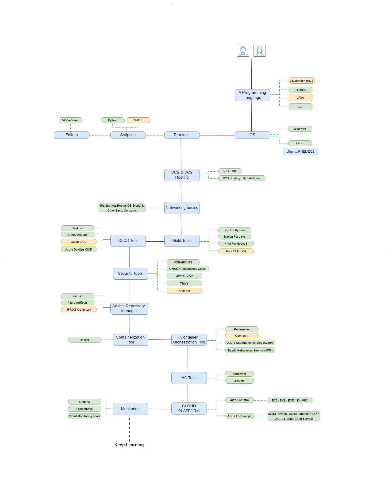

# DevSecOps & Cloud DevOps Roadmap Syllabus

# Programming Language
- Python
- Java
- Node.js
- Go

  From a DevOps perspective, here are the key topics to learn for each programming language:

**Python:**

1. **Scripting and Automation:**
   - Writing scripts for automation tasks (e.g., deployment, configuration management).
   - Using libraries like `os`, `subprocess`, and `shutil` for system interactions.

2. **Package Management:**
   - Understanding and using tools like `pip` for managing Python packages.

3. **Testing and Quality Assurance:**
   - Familiarity with testing frameworks like `unittest`, `pytest`, and tools like `coverage`.

4. **Configuration Management:**
   - Working with tools like Ansible or writing configuration scripts in Python.

5. **Web Development (Optional):**
   - Flask or Django for creating web applications if web development is relevant to your DevOps tasks.

6. **Data Processing and Manipulation:**
   - Using libraries like `pandas` for data manipulation and analysis.

7. **API Interaction:**
   - Interacting with REST APIs using libraries like `requests`.

**Java:**

1. **Build Tools:**
   - Maven or Gradle for managing dependencies and building Java projects.

2. **Containerization (Optional):**
   - Using Java for creating applications that can be containerized with Docker.

3. **Web Services:**
   - Understanding servlets, JAX-RS for RESTful services, and JAX-WS for SOAP services.

4. **Spring Framework (Optional):**
   - Knowledge of Spring Boot, Spring MVC, and Spring Data can be beneficial for Java-based microservices.

**Node.js:**

1. **JavaScript:**
   - Understanding JavaScript fundamentals as Node.js is built on JavaScript.

2. **Package Management:**
   - Using `npm` for managing Node.js packages.

3. **Web Development:**
   - Express.js for building web applications and APIs.

4. **Asynchronous Programming:**
   - Understanding the event-driven, non-blocking I/O model of Node.js.

5. **Testing:**
   - Mocha or Jest for testing Node.js applications.

**Go:**

1. **Concurrency and Parallelism:**
   - Understanding Goroutines and channels for concurrent programming.

2. **Static Binary Compilation:**
   - Go compiles to a single executable, making it a good choice for building containers and microservices.

3. **Networking:**
   - Familiarity with the `net` package for building network applications.

4. **Web Development (Optional):**
   - Frameworks like Gin or Revel for building web applications in Go.

5. **Tooling:**
   - Experience with Go's toolset for testing, benchmarking, and profiling.

Remember that while these are important topics, the specific areas you focus on may also depend on the requirements of your particular DevOps role or projects. Additionally, hands-on experience and building projects will greatly enhance your proficiency in these languages from a DevOps perspective.

# Operating Systems
- Linux
- Windows

From a DevOps perspective, it's important to have a good understanding of both Linux and Windows operating systems. Here are the key topics to learn for each:

**Linux:**

1. **Basic Commands:**
   - File and directory operations (ls, cd, mkdir, rm, mv, etc.)
   - File permissions (chmod, chown)
   - Process management (ps, kill, top)
   - Text processing (grep, sed, awk)

2. **User and Group Management:**
   - Creating and managing users
   - Setting user permissions
   - Managing groups

3. **Package Management:**
   - Using package managers (apt, yum, dnf)
   - Installing, updating, and removing software packages

4. **Filesystem and Disk Management:**
   - Understanding file systems (ext4, xfs, etc.)
   - Mounting and unmounting disks
   - Managing partitions (fdisk, parted)

5. **Networking:**
   - IP addressing and subnets
   - Basic network configuration (ifconfig, route, netstat)
   - Firewall management (iptables)

6. **Shell Scripting:**
   - Writing and executing shell scripts (bash, sh)
   - Variables, loops, conditionals, functions

7. **Service Management:**
   - Starting, stopping, and restarting services (systemctl)
   - Managing systemd units

8. **Managing Logs:**
   - Viewing and analyzing log files (tail, grep, journalctl)
   - Log rotation and retention

9. **Security and Permissions:**
   - User authentication (SSH keys, password policies)
   - Firewall and security configurations

10. **Monitoring and Performance:**
    - Monitoring system performance (top, vmstat, sar)
    - Resource utilization (CPU, memory, disk usage)

**Windows:**

1. **Basic Commands:**
   - Command Prompt operations (dir, cd, mkdir, del, copy, etc.)
   - PowerShell basics

2. **User and Group Management:**
   - User account management
   - Group policy management

3. **Package Management:**
   - Using package managers (Chocolatey, PowerShell Gallery)
   - Installing, updating, and removing software packages

4. **Filesystem and Disk Management:**
   - Understanding NTFS file system
   - Disk management tools (Disk Management, Diskpart)

5. **Networking:**
   - IP addressing and subnets
   - Network configuration through GUI and command line

6. **PowerShell Scripting:**
   - Writing and executing PowerShell scripts
   - Variables, loops, conditionals, functions

7. **Service Management:**
   - Starting, stopping, and restarting services
   - Managing Windows services

8. **Event Viewer and Logs:**
   - Using Event Viewer to monitor system events
   - Viewing and analyzing log files

9. **Security and Permissions:**
   - User authentication and access control
   - Windows Firewall and security configurations

10. **Performance Monitoring:**
    - Task Manager for resource utilization
    - Performance Monitor for detailed metrics

Remember to practice hands-on exercises and projects to solidify your understanding of these topics in both Linux and Windows environments. Additionally, familiarity with both operating systems will be valuable for managing a diverse set of systems in a DevOps role.

# Terminals
- Scripting
  - Shell
  - Python
- Editors
  - Vi
  - Vim
  - Nano
    
From a DevOps perspective, here are the key topics to focus on for scripting and editors:

**Scripting:**
1. **Shell Scripting:**
   - Basic syntax and commands (if-else, loops, functions)
   - Working with variables and arrays
   - Handling command-line arguments
   - File operations (reading, writing, permissions)
   - Process management (background jobs, signals)
   - Error handling and exit codes
   - Advanced scripting techniques (subshells, process substitution)

2. **Python Scripting:**
   - Basic syntax and data types
   - Conditional statements and loops
   - Functions and modules
   - File I/O operations
   - Error handling (try, except, finally)
   - Working with JSON and XML data
   - Interacting with REST APIs
   - Unit testing in Python (using `unittest` or `pytest`)
   - Working with third-party libraries (e.g., requests, BeautifulSoup)

**Editors:**
1. **Vi (Vim):**
   - Modes in Vi (Normal, Insert, Command-Line)
   - Basic movement commands (h, j, k, l)
   - Editing operations (inserting, deleting, copying, pasting)
   - Searching and replacing
   - Working with multiple buffers and windows
   - Using macros for repetitive tasks
   - Customizing Vi with .vimrc file
   - Understanding Vim plugins and extensions

2. **Nano:**
   - Navigating the Nano interface (menus, shortcuts)
   - Basic text editing (inserting, deleting, copying)
   - Searching and replacing text
   - Saving and exiting files
   - Customizing Nano with .nanorc file
   - Advanced features (syntax highlighting, line numbers)

# Version Control System (VCS)
- Git

1. **Repository Setup:**
   - Initializing a new Git repository.
   - Cloning an existing repository.
   - Setting up a remote repository (e.g., GitHub, GitLab, Bitbucket).

2. **Basic Commands:**
   - `git init`: Initialize a new Git repository.
   - `git clone`: Clone an existing repository.
   - `git add`: Add files to the staging area.
   - `git commit`: Commit changes to the local repository.

3. **Branching and Merging:**
   - Creating branches (`git branch`).
   - Switching between branches (`git checkout`).
   - Merging branches (`git merge`).

4. **Remote Repositories:**
   - Adding a remote repository (`git remote add`).
   - Pushing changes to a remote repository (`git push`).
   - Pulling changes from a remote repository (`git pull`).

5. **Collaboration:**
   - Working with pull requests and code reviews.
   - Handling merge conflicts.

6. **Tagging and Releases:**
   - Creating tags to mark specific points in history.
   - Creating and managing releases.

7. **Git Workflows:**
   - Understanding popular Git workflows (e.g., Gitflow, GitHub flow, GitLab flow).

8. **Advanced Git Techniques:**
   - Interactive rebasing (`git rebase -i`).
   - Cherry-picking commits.
   - Submodules and subtrees.

9. **Git Hooks:**
   - Using pre-commit and post-commit hooks for automation.

10. **Git Best Practices:**
    - Commit messages (clear, concise, and descriptive).
    - Atomic commits (small, focused changes).
    - Branch naming conventions.

11. **Git GUIs and Tools:**
    - Familiarity with Git GUI clients like GitKraken, Sourcetree, etc.
    - Utilizing command-line tools like Git Bash, Git GUI, etc.

12. **Git Hosting Platforms:**
    - Integrating Git with popular hosting platforms (e.g., GitHub, GitLab, Bitbucket).
    - Understanding features like issues, pull requests, and workflows provided by these platforms.

Remember, practical experience is essential when learning Git. Regularly work on projects, collaborate with others, and actively use Git commands to reinforce your understanding.

## Version Control System Hosting
- Github
- Gitlab
- Azure Repo

# Networking Basics
- IPs and Subnets
- OSI Model
- Other Basic Concepts

1. **IP Addresses and Subnets:**
   - Understanding IP addressing, IPv4 vs IPv6, CIDR notation.
   - Subnetting and subnet masks.

2. **OSI Model:**
   - Understanding the OSI model's seven layers (Physical, Data Link, Network, Transport, Session, Presentation, Application).
   - Knowing the functions and protocols associated with each layer.

3. **TCP/IP Protocol Suite:**
   - Understanding the TCP/IP protocol stack.
   - Familiarity with key protocols such as TCP, UDP, ICMP, HTTP, HTTPS, DNS, SMTP.

4. **DNS (Domain Name System):**
   - Understanding how DNS works.
   - Configuring DNS servers and understanding different types of DNS records (A, CNAME, MX, etc.).

5. **Routing and Switching:**
   - Basics of routers and switches.
   - Understanding how routing tables work.
   - VLANs and subnetting in the context of switches.

6. **Firewalls and Security:**
   - Basics of network security.
   - Knowledge of firewalls, both hardware and software-based.
   - Understanding access control lists (ACLs).

7. **Load Balancing:**
   - Types of load balancing (e.g., DNS-based, Layer 4, Layer 7).
   - Configuring and managing load balancers.

8. **NAT (Network Address Translation):**
   - Understanding NAT concepts and its role in network address management.
   - Different types of NAT (Static, Dynamic, PAT).

9. **Proxy Servers:**
   - Understanding the purpose and function of proxy servers.
   - Configuring and managing proxy servers.

10. **VPN (Virtual Private Network):**
    - Basics of VPN technology and its use cases.
    - Setting up and configuring VPNs for secure communication.

11. **Subnetting and Supernetting:**
    - Understanding how to break down and combine subnets.
    - Calculating subnets and supernetting for efficient address allocation.

12. **Wireless Networking:**
    - Basics of Wi-Fi technology.
    - Configuring and securing wireless networks.

13. **Troubleshooting Network Issues:**
    - Diagnosing common network problems (e.g., connectivity, latency, DNS resolution).
    - Using network troubleshooting tools (e.g., ping, traceroute, nslookup).

14. **Basic Security Measures:**
    - Understanding basic security practices for network devices.
    - Implementing measures to protect against common network attacks.

15. **Network Monitoring and Logging:**
    - Using network monitoring tools to track traffic and performance.
    - Setting up logging and analyzing logs for security and performance insights.

# Build Tools
- Python: Pip
- Java: Maven
- Node.js: NPM
- .NET: Dotnet

1. **Python: Pip**
   - Understanding and working with virtual environments
   - Managing dependencies with requirements.txt
   - Creating and distributing Python packages (setup.py)
   - Integrating Pip with version control systems and CI/CD pipelines

2. **Java: Maven**
   - Project setup and directory structure in Maven
   - Defining and managing dependencies in `pom.xml`
   - Building and packaging Java applications with Maven
   - Configuring Maven plugins for tasks like testing, code coverage, and deployment
   - Repository management with Maven (including local, remote, and central repositories)
   - Understanding and using Maven lifecycles and phases

3. **Node.js: NPM**
   - Initializing a Node.js project with `package.json`
   - Installing, updating, and managing dependencies with NPM
   - Running scripts defined in `package.json`
   - Publishing packages to the NPM registry
   - Managing versioning and semantic versioning (SemVer) in package.json
   - Handling NPM audit and security vulnerabilities

4. **.NET: Dotnet**
   - Setting up a .NET project with `dotnet new`
   - Managing dependencies in `csproj` files
   - Building, running, and publishing .NET applications with `dotnet`
   - Working with NuGet packages and package management in .NET
   - Configuring and using different project types (console app, web app, class library, etc.) with `dotnet`
   - Understanding .NET Core vs. .NET Framework and how it relates to DevOps workflows

# CI-CD Tools
- Primary
  - Jenkins
  - Azure CICD
- Secondary
  - Github Actions
  - Gitlab CICD
 
  From a DevOps perspective, here are the key topics to learn for each of the mentioned CI/CD tools:

**Primary Tools:**

1. **Jenkins:**
   - Installation and Configuration of Jenkins
   - Creating and Managing Jenkins Jobs
   - Integrating Jenkins with Version Control Systems (e.g., Git)
   - Setting up Build Pipelines and Continuous Integration
   - Managing Plugins and Extensions
   - Security and Authentication in Jenkins
   - Jenkins Pipeline (Declarative and Scripted)
   - Distributed Builds and Agents
   - Jenkinsfile and Pipeline as Code
   - Jenkins Shared Libraries
   - Integrating Jenkins with Other DevOps Tools (e.g., Docker, Kubernetes)

2. **Azure CI/CD:**
   - Setting up Azure DevOps Services/Organizations
   - Creating and Configuring Azure Pipelines
   - Defining Build and Release Pipelines
   - Integrating with Source Control (e.g., Git)
   - Artifacts and Package Management in Azure DevOps
   - Variables and Configuration Management
   - Deployment Strategies (e.g., Blue/Green, Canary)
   - Environments and Deployment Gates
   - Integrating Azure DevOps with Azure Resources (e.g., Azure Functions, Web Apps, VMs)
   - Security and Permissions in Azure DevOps

**Secondary Tools:**

3. **GitHub Actions:**
   - Understanding YAML Workflows
   - Creating and Configuring Actions Workflows
   - Workflow Triggers and Events
   - Using Actions for Continuous Integration and Deployment
   - Integrating with GitHub Repository and Actions Marketplace
   - Environment and Workflow Matrices
   - Secrets and Secure Variables
   - Caching Dependencies in Workflows
   - Custom Actions and Docker Containers in Workflows
   - GitHub Actions Workflow Syntax and Best Practices

4. **GitLab CI/CD:**
   - .gitlab-ci.yml Configuration
   - Defining Jobs, Stages, and Artifacts
   - GitLab Runners and Executors
   - Registering and Configuring Runners
   - Setting up Shared Runners
   - CI/CD Pipelines and Triggers
   - GitLab CI/CD Environment Variables
   - Auto DevOps and Pre-defined CI/CD Templates
   - Container Registry and Docker Image Management
   - Code Quality and Security Scanning in CI/CD

Remember to practice hands-on with these tools, build sample pipelines, and work on projects to gain practical experience. Additionally, exploring best practices and advanced features will further enhance your proficiency in using these CI/CD tools in a DevOps context.

# Security Tools
- Sonarqube
- OWASP Dependency Check
- OWASP ZAP
- Trivy
- Anchore

1. **SonarQube:**
   - Installation and Configuration
   - Setting Up Projects and Analysis
   - Understanding Quality Gates
   - Code Quality Metrics
   - Integration with CI/CD pipelines (e.g., Jenkins, Azure DevOps)
   - Remediation of Code Smells and Vulnerabilities
   - Custom Rules and Quality Profiles
   - Setting Up Webhooks and Notifications
   - Understanding Security Hotspots

2. **OWASP Dependency Check:**
   - Dependency Scanning Process
   - Integrating with Build Tools (e.g., Maven, NPM)
   - Integration with CI/CD Pipelines
   - Generating Reports and Output Formats
   - Configuring Policy Violations
   - Remediation Strategies for Vulnerable Dependencies

3. **OWASP ZAP (Zed Attack Proxy):**
   - Installation and Setup
   - Understanding Spidering and Scanning
   - Automated Scans in CI/CD Pipelines
   - Creating and Running Policies
   - Authentication and Session Management
   - Handling False Positives and Exclusions
   - Integrating with Reporting Tools
   - Continuous Security Testing with ZAP

4. **Trivy:**
   - Container Image Vulnerability Scanning
   - CLI Usage and Basic Commands
   - Integration with CI/CD Pipelines
   - Working with Different Image Registries (e.g., Docker Hub)
   - Policy Configuration and Violation Handling
   - Scanning Offline Images
   - Customization and Extending Trivy

5. **Anchore:**
   - Container Image Analysis and Inspection
   - Image Vulnerability Scanning
   - Policies and Policy Enforcement
   - Integration with CI/CD Pipelines
   - Handling False Positives and Exclusions
   - Customizing Vulnerability Feeds
   - User Roles and Permissions
   - Anchore CLI Usage and Basic Commands

# Artifact Repository Manager
- Nexus3
- JFrog Artifactory
- Azure Artifacts

**Nexus3:**
1. **Installation and Setup:**
   - Installing Nexus3 on your preferred platform.
   - Configuring initial settings and user accounts.

2. **Repositories:**
   - Understanding different types of repositories (e.g., hosted, proxy, group).
   - Creating and managing repositories for various package types (e.g., Maven, npm, Docker).

3. **Proxy Repositories:**
   - Setting up proxy repositories to cache external dependencies.
   - Configuring repository policies and behavior.

4. **Hosted Repositories:**
   - Creating hosted repositories to store and manage internal artifacts.
   - Configuring security and access controls for hosted repositories.

5. **Group Repositories:**
   - Creating group repositories to aggregate multiple repositories.
   - Using group repositories to provide a unified view of artifacts.

6. **Artifact Management:**
   - Uploading and managing artifacts in Nexus3.
   - Understanding versioning and metadata associated with artifacts.

7. **Artifact Lifecycle:**
   - Implementing policies for retention and cleanup of artifacts.
   - Configuring tasks for automatic cleanup.

8. **Security and Access Control:**
   - Setting up roles and privileges for users and groups.
   - Implementing fine-grained access controls for repositories.

9. **Integration with Build Tools:**
   - Configuring build tools (e.g., Maven) to use Nexus3 as a repository.
   - Managing dependencies and releases through Nexus3.

10. **Search and Browse:**
    - Utilizing search capabilities to locate specific artifacts.
    - Browsing artifacts and their associated metadata.

**JFrog Artifactory:**
1. **Installation and Setup:**
   - Installing JFrog Artifactory on your preferred platform.
   - Configuring initial settings and user accounts.

2. **Repositories:**
   - Understanding different types of repositories (e.g., local, remote, virtual).
   - Creating and managing repositories for various package types (e.g., Maven, npm, Docker).

3. **Local Repositories:**
   - Creating local repositories to store and manage internal artifacts.
   - Configuring security and access controls for local repositories.

4. **Remote Repositories:**
   - Setting up remote repositories to proxy and cache external dependencies.
   - Configuring repository behavior and caching strategies.

5. **Virtual Repositories:**
   - Creating virtual repositories to aggregate multiple repositories.
   - Using virtual repositories to provide a unified view of artifacts.

6. **Artifact Management:**
   - Uploading and managing artifacts in JFrog Artifactory.
   - Understanding versioning and metadata associated with artifacts.

7. **Artifact Lifecycle:**
   - Implementing policies for retention and cleanup of artifacts.
   - Configuring tasks for automatic cleanup.

8. **Security and Access Control:**
   - Setting up roles and permissions for users and groups.
   - Implementing fine-grained access controls for repositories.

9. **Integration with Build Tools:**
   - Configuring build tools (e.g., Maven) to use JFrog Artifactory as a repository.
   - Managing dependencies and releases through Artifactory.

10. **Search and Browse:**
    - Utilizing search capabilities to locate specific artifacts.
    - Browsing artifacts and their associated metadata.

**Azure Artifacts:**
1. **Azure DevOps Integration:**
   - Setting up Azure Artifacts within Azure DevOps.
   - Configuring feed permissions and access.

2. **Feeds:**
   - Understanding and creating feeds to organize artifacts.
   - Configuring retention policies for feeds.

3. **Artifact Management:**
   - Uploading and managing artifacts in Azure Artifacts.
   - Understanding versioning and metadata associated with artifacts.

4. **Package Types:**
   - Supporting various package types (e.g., npm, NuGet, Maven) within feeds.
   - Managing packages specific to each type.

5. **Security and Access Control:**
   - Configuring access control policies for feeds and packages.
   - Managing permissions for users and groups.

6. **Build Pipeline Integration:**
   - Integrating Azure Artifacts into CI/CD pipelines.
   - Publishing and consuming artifacts in build processes.

7. **Versioning and Dependency Management:**
   - Handling versioning of packages and dependencies.
   - Resolving package dependencies in builds.

8. **Artifact Lifecycle:**
   - Implementing policies for retention and cleanup of artifacts.
   - Configuring tasks for automatic cleanup.

9. **Search and Browse:**
    - Utilizing search capabilities to locate specific artifacts.
    - Browsing artifacts and their associated metadata.

Remember, practical hands-on experience and real-world application of these topics will greatly enhance your understanding and proficiency with these artifact repository managers.
# Containerization Tools
- Docker
  - Dockerfile
  - Docker Image
  - Docker Container
  - Docker Compose
  - Docker Volume
  - Docker Network

1. **Docker:**
   - Understanding Docker basics, including its architecture and key components.
   - Working with Docker CLI commands for managing containers.

2. **Dockerfile:**
   - Creating and customizing Dockerfiles to define container images.
   - Understanding the syntax and best practices for writing Dockerfiles.
   - Building Docker images from Dockerfiles.

3. **Docker Image:**
   - Understanding Docker images as read-only templates for creating containers.
   - Managing and organizing Docker images locally and in Docker registries (like Docker Hub, JFrog Artifactory, etc.).

4. **Docker Container:**
   - Running and managing Docker containers from Docker images.
   - Exploring options for container management, including starting, stopping, pausing, and restarting containers.

5. **Docker Compose:**
   - Defining multi-container applications with Docker Compose.
   - Utilizing `docker-compose.yml` files to specify services, networks, and volumes for Docker applications.
   - Managing Docker Compose services and applications.

6. **Docker Volume:**
   - Understanding Docker volumes for persistent data storage.
   - Creating, managing, and deleting Docker volumes.
   - Mounting Docker volumes in containers for data persistence.

7. **Docker Network:**
   - Configuring Docker networks for inter-container communication.
   - Creating custom Docker networks and connecting containers to them.
   - Understanding the different types of Docker networks (bridge, overlay, host, none).

# Container Orchestration Tools
- Kubernetes
- Openshift
- AWS: EKS (Elastic Kubernetes Service)
- Azure: AKS (Azure Kubernetes Service)

Kubernetes, AWS EKS (Elastic Kubernetes Service), and Azure AKS (Azure Kubernetes Service) from a DevOps perspective:

**Kubernetes:**

1. **Kubernetes Architecture:**
   - Understand the various components like Master Node, Worker Nodes, etcd, API server, Controller Manager, Scheduler, Kubelet, Kube Proxy, etc.

2. **Kubectl and API Resources:**
   - Learn how to interact with the Kubernetes cluster using kubectl and understand various API resources like pods, deployments, services, etc.

3. **Deployments and Pods:**
   - Understand how to create and manage deployments for containerized applications. Learn about pods, replicasets, and deployments.

4. **Services and Ingress:**
   - Explore different types of services (ClusterIP, NodePort, LoadBalancer) and how to expose applications to the internet using Ingress.

5. **ConfigMaps and Secrets:**
   - Learn how to manage configuration data and sensitive information using ConfigMaps and Secrets.

6. **Volumes and Persistent Volumes:**
   - Understand how to manage data in Kubernetes using volumes and persistent volumes.

7. **Namespaces and RBAC:**
   - Learn about namespaces for organizing resources and Role-Based Access Control for managing permissions.

8. **Networking in Kubernetes:**
   - Understand how networking works within a Kubernetes cluster. This includes Service Networking, Pod Networking, and Network Policies.

9. **Monitoring and Logging:**
   - Explore tools and best practices for monitoring and logging in a Kubernetes environment.

10. **Helm:**
    - Learn about Helm, a package manager for Kubernetes, to package and deploy applications.

**AWS EKS (Elastic Kubernetes Service):**

1. **AWS Account Setup:**
   - Understand how to create an AWS account and configure the necessary IAM roles and policies for EKS.

2. **EKS Cluster Creation:**
   - Learn how to create an EKS cluster using AWS Management Console or AWS CLI.

3. **Node Groups and Autoscaling:**
   - Understand how to create and manage worker node groups and set up autoscaling.

4. **VPC and Subnet Configuration:**
   - Learn about setting up Virtual Private Cloud (VPC) and subnets for EKS.

5. **Load Balancers and Ingress Controllers:**
   - Configure load balancers and set up Ingress controllers for applications.

6. **IAM Roles and Policies:**
   - Understand the IAM roles and policies needed for EKS clusters, worker nodes, and services.

7. **EKS Networking:**
   - Learn about networking considerations for EKS, including VPC Peering and VPN connections.

8. **Access and Authentication:**
   - Set up role-based access control (RBAC) and configure kubeconfig for cluster access.

**Azure AKS (Azure Kubernetes Service):**

1. **Azure Account Setup:**
   - Understand how to create an Azure account and configure the necessary resources.

2. **AKS Cluster Creation:**
   - Learn how to create an AKS cluster using Azure portal or Azure CLI.

3. **Node Pools and Scaling:**
   - Understand how to create and manage node pools, and set up auto-scaling.

4. **VNET Integration:**
   - Configure Virtual Network (VNET) integration for AKS clusters.

5. **Load Balancers and Ingress Controllers:**
   - Configure load balancers and set up Ingress controllers for applications.

6. **Azure Active Directory (AAD) Integration:**
   - Learn how to integrate AKS with Azure Active Directory for authentication.

7. **Role-Based Access Control (RBAC):**
   - Set up RBAC for managing access to the AKS cluster.

8. **Azure Container Registry (ACR) Integration:**
   - Integrate AKS with Azure Container Registry for managing container images.

Remember to practice hands-on labs and deploy sample applications in both AWS EKS and Azure AKS to solidify your understanding of these services.

# Infrastructure as Code (IAC) Tools
- Terraform
- Ansible

### Terraform:

1. **Infrastructure as Code (IAC):**
   - Understanding the concept of treating infrastructure like software code.

2. **Terraform Basics:**
   - Installation and setup.
   - Configuration files (`.tf` files) syntax and structure.
   - Providers and modules.

3. **Terraform State:**
   - Importance of state management.
   - Remote and local state storage.
   - State locking and backends.

4. **Resource Management:**
   - Defining and managing resources in Terraform.
   - Common resource types (e.g., `aws_instance`, `azurerm_virtual_machine`, etc.).

5. **Variables and Outputs:**
   - Using variables to parameterize configurations.
   - Defining outputs for sharing information.

6. **Modules:**
   - Organizing and reusing Terraform code.
   - Creating and using modules.

7. **Data Sources:**
   - Utilizing external information in Terraform configurations.
   - Retrieving data from providers.

8. **Provisioners:**
   - Using provisioners to perform tasks on local or remote resources after they're created.

9. **Interpolation and Functions:**
   - Utilizing Terraform's interpolation syntax and built-in functions.

10. **Workspaces:**
    - Managing multiple environments with workspaces.

11. **Remote Backends:**
    - Configuring remote backends for state storage.

12. **State Management Best Practices:**
    - Strategies for managing Terraform state effectively.

13. **Remote Execution:**
    - Running Terraform configurations on remote systems or in CI/CD pipelines.

14. **Error Handling and Troubleshooting:**
    - Handling errors and debugging Terraform configurations.

### Ansible:

1. **Configuration Management:**
   - Understanding Ansible's role in configuration management.

2. **Ansible Playbooks:**
   - Writing YAML-based playbooks for task automation.

3. **Inventory:**
   - Managing host inventories for Ansible.

4. **Modules:**
   - Exploring built-in modules for various tasks (e.g., `yum`, `apt`, `copy`, `shell`, etc.).

5. **Variables and Facts:**
   - Defining variables and using facts for dynamic behavior.

6. **Conditionals and Loops:**
   - Implementing conditionals (`when`) and loops (`with_items`, `loop`, etc.) in playbooks.

7. **Roles:**
   - Organizing and reusing Ansible code with roles.

8. **Handlers:**
   - Managing tasks that respond to specific events.

9. **Templates:**
   - Using Jinja2 templates for dynamic content generation.

10. **Vault and Secrets Management:**
    - Storing and managing sensitive information using Ansible Vault.

11. **Roles Dependencies:**
    - Defining dependencies between roles.

12. **Error Handling and Debugging:**
    - Handling errors and debugging playbooks.

13. **Dynamic Inventory:**
    - Using dynamic inventory scripts to manage infrastructure.

14. **Ansible Tower/AWX:**
    - Introduction to the web-based UI for Ansible automation.

Remember to practice regularly, work on real-world projects, and participate in scenarios that involve both Terraform and Ansible. This will help solidify your understanding and proficiency in using these tools for DevOps purposes.

# Cloud Platforms
- AWS
  - EC2 (Elastic Compute Cloud)
  - ECR (Elastic Container Registry)
  - EKS (Elastic Kubernetes Service)
  - S3 (Simple Storage Service)
  - VPC (Virtual Private Cloud)
- Azure
  - Azure DevOps
  - Azure Functions
  - App Service
  - Storage
  - AKS (Azure Kubernetes Service)
  - ACR (Azure Container Registry)
 
From a DevOps perspective, here are the key topics you should focus on for each of the mentioned AWS and Azure services:

**AWS:**

1. **EC2 (Elastic Compute Cloud):**
   - Launching, managing, and scaling EC2 instances.
   - Working with EC2 instance types, regions, and availability zones.
   - Security Groups, Key Pairs, and IAM roles for EC2.
   - AMIs (Amazon Machine Images) and snapshots.
   - Auto Scaling Groups and Load Balancers.

2. **ECR (Elastic Container Registry):**
   - Docker image registry in AWS.
   - Pushing and pulling Docker images to/from ECR.
   - Repository management and permissions.

3. **EKS (Elastic Kubernetes Service):**
   - Setting up and managing Kubernetes clusters on AWS.
   - Working with Worker Nodes and Node Groups.
   - Deploying applications to EKS clusters.
   - Integrating EKS with AWS services like ECR and VPC.

4. **S3 (Simple Storage Service):**
   - Object storage in AWS.
   - Uploading and downloading objects to/from S3 buckets.
   - Working with buckets, permissions, and versioning.
   - Setting up static website hosting with S3.

5. **VPC (Virtual Private Cloud):**
   - Creating and configuring VPCs.
   - Subnets, Route Tables, Internet Gateways, and NAT Gateways.
   - Security Groups and Network Access Control Lists (NACLs).
   - VPC Peering and VPN connections.

**Azure:**

1. **Azure DevOps:**
   - CI/CD pipelines using Azure Pipelines.
   - Version control with Azure Repos.
   - Agile project management with Azure Boards.
   - Artifact management with Azure Artifacts.

2. **Azure Functions:**
   - Serverless computing in Azure.
   - Creating, deploying, and managing functions.
   - Triggers and bindings.
   - Integration with other Azure services.

3. **App Service:**
   - Hosting web applications in Azure.
   - Deployment slots and auto-scaling.
   - Custom domains and SSL certificates.
   - Monitoring and diagnostics.

4. **Storage:**
   - Azure Blob Storage for object storage.
   - Azure Table Storage for NoSQL data.
   - Azure File Storage for file shares.
   - Azure Queue Storage for messaging.

5. **AKS (Azure Kubernetes Service):**
   - Setting up and managing Kubernetes clusters in Azure.
   - Working with Node Pools and Container Insights.
   - Deploying and managing applications on AKS clusters.

6. **ACR (Azure Container Registry):**
   - Docker image registry in Azure.
   - Pushing and pulling Docker images to/from ACR.
   - Repository management and permissions.

For each of these topics, it's important to understand not only the basic concepts but also how to practically implement and integrate them into your DevOps workflows. Hands-on experience through labs, tutorials, and real-world projects will be crucial for gaining proficiency in these services.

### Monitoring
- Grafana
- Prometheus
- Cloud Monitoring Tools (Platform-specific)

**Grafana:**
1. **Introduction to Grafana**
   - What is Grafana?
   - Why is it used in DevOps?

2. **Installation and Setup**
   - Installing Grafana on various platforms (Linux, Windows, Docker)
   - Configuring datasources (e.g., Prometheus, InfluxDB, etc.)

3. **Creating Dashboards**
   - Adding panels and visualizations
   - Organizing dashboards effectively

4. **Alerting and Notifications**
   - Setting up alert rules
   - Integrating with notification channels (e.g., email, Slack, etc.)

5. **Templating and Variables**
   - Using variables for dynamic dashboards
   - Creating template variables for flexible querying

6. **Plugins and Integrations**
   - Exploring and installing plugins for extended functionality
   - Integrating with other tools (e.g., Azure Monitor, AWS CloudWatch, etc.)

7. **Security and Authentication**
   - Implementing authentication methods (e.g., LDAP, OAuth, etc.)
   - Role-based access control (RBAC) in Grafana

8. **Backups and Restores**
   - Creating backups of configurations and data
   - Restoring from backups in case of failures

9. **Scaling and High Availability**
   - Configuring Grafana for scalability and redundancy
   - Setting up Grafana in a clustered environment

10. **Performance Optimization**
    - Tuning Grafana for better performance
    - Best practices for handling large datasets

**Prometheus:**
1. **Introduction to Prometheus**
   - What is Prometheus and its role in monitoring?
   - Why is it widely used in DevOps?

2. **Installation and Configuration**
   - Setting up Prometheus server and storage
   - Configuring targets for scraping (e.g., exporters, services)

3. **PromQL (Prometheus Query Language)**
   - Basic querying and filtering
   - Aggregation and visualization of metrics

4. **Alerting Rules**
   - Defining alerting rules for specific conditions
   - Configuring alertmanager for notifications

5. **Service Discovery and Relabelling**
   - Implementing dynamic service discovery
   - Modifying labels for better metric management

6. **Scraping Best Practices**
   - Configuring scraping intervals and timeouts
   - Avoiding common pitfalls in scraping configurations

7. **Federation and Remote Storage**
   - Setting up Prometheus federation for cross-cluster monitoring
   - Configuring remote storage backends (e.g., long-term storage)

8. **Exporters and Integrations**
   - Understanding and deploying exporters (e.g., Node Exporter, Blackbox Exporter, etc.)
   - Integrating with other monitoring systems and tools

9. **High Availability and Reliability**
   - Configuring Prometheus in a high availability setup
   - Best practices for ensuring reliability of Prometheus

**Cloud Monitoring Tools (Platform-specific):**
(Note: Topics will vary based on the cloud platform chosen, e.g., AWS, Azure, GCP, etc.)

1. **Setting up Cloud Monitoring Services**
   - Understanding the native monitoring services provided by the cloud platform

2. **Metrics and Alarms**
   - Exploring available metrics and setting up alarms for critical thresholds

3. **Log Management and Analysis**
   - Utilizing cloud-native log management solutions

4. **Tracing and Profiling (if available)**
   - Exploring tools for distributed tracing and performance profiling

5. **Integration with DevOps Pipelines**
   - Incorporating cloud monitoring into CI/CD workflows

6. **Cost Optimization and Budgeting**
   - Utilizing monitoring data for cost analysis and optimization

Remember, hands-on practice and experimentation are crucial in gaining proficiency with these tools. Additionally, consider working on projects that involve these technologies to apply your knowledge in real-world scenarios.

### Best Practices and Case Studies
- Implementing DevSecOps in Real-world Scenarios
- Industry-specific Best Practices

### Practical Projects and Labs
- Building CI/CD Pipelines
- Implementing Security Scans in CI/CD Pipelines
- Infrastructure Automation with IAC Tools
- Deploying Applications on Container Orchestration Platforms

### Certifications (Optional)
- AWS Certified DevOps Engineer 
- Azure DevOps Engineer Expert
- Kubernetes Certified Administrator

### RealTime Troubleshooting
- DevOps Tools Errors
- Devops tools troubleshooting

